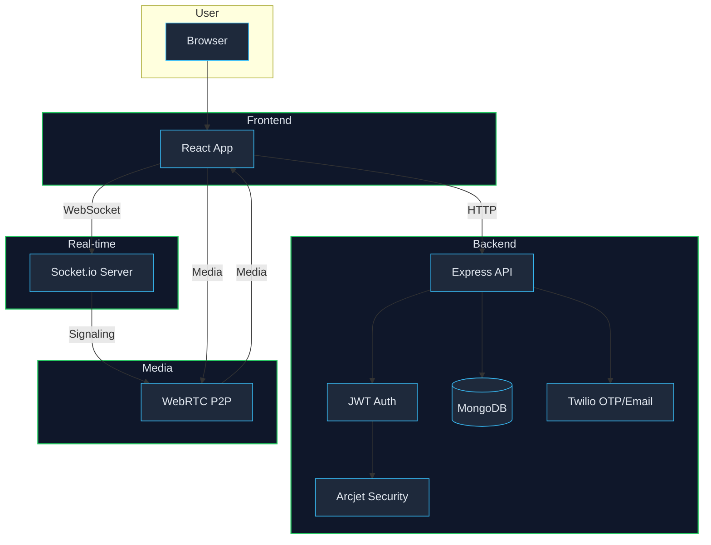
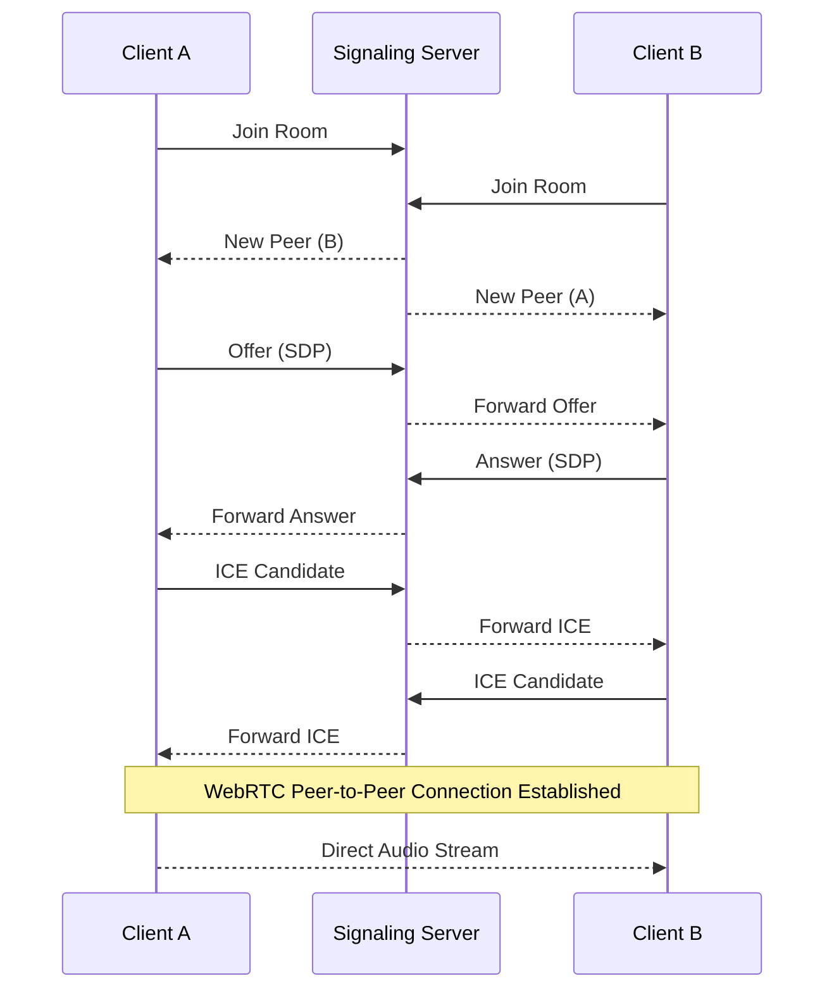

# Targer Chatroom
Voice chat application with real-time features.

## Overview

Targer Chatroom is a full-stack web application that allows users to create and join real-time audio chat rooms. It's designed for seamless communication, offering both public and private rooms to suit different needs. The core of the application is built on WebRTC for peer-to-peer audio communication, with a Node.js backend and a React frontend.

### Core Features

  * **Real-time Audio:** High-quality, low-latency audio communication using WebRTC.
  * **Public , Social Rooms & Private Rooms:** Create public rooms for anyone to join, or private rooms for invite-only conversations.
  * **User Authentication:** Secure user authentication with email verification.
  * **User Profiles:** Customizable user profiles with avatars and personal information.
  * **Dockerized Environment:** The entire application is containerized with Docker, making it easy to set up and run in any environment.

## Architecture

Gethory follows a classic client-server architecture, with a few key components working together to provide real-time communication.

<h2 align="center">WebRTC Architecture</h2>

<p align="center">
<sub>React | Node.js | WebRTC | Socket.io |MongoDB | JWT | Arcjet | Twilio</sub>
</p>



### WebRTC Flow

1. User accesses the application through the browser.

2. The React frontend loads and allows the user to sign up or log in.

3. Authentication Process:
   - User submits credentials (email/phone).
   - Backend (Node.js + Express) verifies the user.
   - OTP is sent via Twilio for verification (if required).
   - Upon successful verification, a JWT token is generated.
   - The token is stored on the client for authenticated requests.

4. Security Layer:
   - Arcjet middleware protects APIs (rate limiting, bot protection, etc.).
   - All protected routes validate the JWT before processing requests.

5. Database Interaction:
   - User data, room data, and session details are stored in MongoDB.
   - Backend performs CRUD operations as needed.

6. Room Joining:
   - User requests to join/create a room via HTTP API.
   - Backend validates and returns room details.

7. Real-time Connection:
   - Frontend establishes a WebSocket connection using Socket.io.
   - User joins a room channel on the signaling server.

8. Signaling Process:
   - When a new user joins, existing users are notified.
   - SDP Offer/Answer is exchanged via the signaling server.
   - ICE candidates are exchanged to establish connectivity.

9. WebRTC Connection:
   - A peer-to-peer (P2P) connection is established between users.
   - Audio/video streams are shared directly between clients.

10. Media Communication:
    - Once connected, media flows directly between peers.
    - Backend is no longer involved in media transmission.

11. Real-time Updates:
    - Socket events handle user join/leave, speaker updates, and room state changes.
    - UI updates dynamically based on these events.

12. Session Handling:
    - JWT ensures secure communication for API requests.
    - Users remain authenticated until logout or token expiration.

<!-- end list -->




## Tech Stack

| Category | Technology |
| --- | --- |
| **Frontend** | React, Redux, TypeScript, Tailwind CSS |
| **Backend** | Node.js, Express |
| **Database** | MongoDB |
| **Realtime** | WebRTC, Socket.IO |
| **Containerization**| Docker, Docker Compose |
| **Cloud** | AWS (EC2, S3, RDS) |


## Prerequisites

  * Node.js (v18 or higher)
  * npm (v8 or higher)
  * Docker
  * Docker Compose

## Configuration

All configuration is managed through environment variables in the `backend/.env` file.

| Variable | Description | Default Value |
| --- | --- | --- |
| `PORT` | The port the backend server will run on. | `3000` |
| `FRONTEND_URL` | The URL of the frontend application. | `http://localhost:5173` |
| `DATABASE_URL` | The connection string for the MongoDB database.| `mongodb://mongo:27017/hlloDB`|
| `JWT_ACCESS_SECRET` | The secret key for signing JWT access tokens.| `your_access_secret` |
| `JWT_REFRESH_SECRET` | The secret key for signing JWT refresh tokens.| `your_refresh_secret` |
| `SENDGRID_API_KEY` | The API key for the Sendgrid email service. | `your_sendgrid_api_key` |
| `SMS_SID` | The secret key for signing twilio account.| `your_twilio_secret` |

## Running Locally

To run the application locally without Docker, you'll need to start the frontend and backend servers separately.

### Backend

```bash
cd backend
npm install
npm run dev
```

### Frontend

```bash
cd frontend
npm install
npm run dev
```

## Docker and Compose

The `docker-compose.yml` file defines the three services that make up the application:

  * `frontend`: The React client, served by Nginx.
  * `backend`: The Node.js API server.
  * `mongo`: The MongoDB database.

To build and run the services, use the following command:

```bash
docker-compose up --build
```

To stop the services, use:

```bash
docker-compose down
```


## Security

  * **Authentication:** User authentication is handled with JWTs. The backend issues access and refresh tokens, which are stored in cookies on the client.
  * **Authorization:** The backend uses middleware to protect routes, ensuring that only authenticated users can access certain resources.
  * **Email Verification:** New users must verify their email address before they can log in.
  * **CORS:** The backend uses the `cors` middleware to restrict requests to the frontend URL.

## Usage

1.  **Sign up:** Create a new account.
2.  **Verify your email:** Check your email for a verification link.
3.  **Log in:** Log in with your new account.
4.  **Create a room:** Create a new room, either public or private.
5.  **Join a room:** Join an existing room.
6.  **Start chatting:** Once you're in a room, you can start chatting with other users.


## RESTFUL API Routes

### Authentication Routes

| Method | Endpoint        | Description                          |
|--------|---------------|--------------------------------------|
| POST   | /send-otp      | Send OTP for login/signup            |
| POST   | /verify-otp    | Verify OTP and authenticate user     |
| POST   | /activate      | Activate user account (Protected)    |
| GET    | /refresh       | Refresh access token                 |
| POST   | /logout        | Logout user (Protected)              |

---

### User Profile Routes

| Method | Endpoint                 | Description                              |
|--------|--------------------------|------------------------------------------|
| POST   | /profile/update          | Update user profile (Protected)          |
| POST   | /profile/send-otp        | Send OTP for profile update (Protected)  |
| POST   | /profile/verify-otp      | Verify OTP for profile update (Protected)|
| GET    | /users/search            | Search users (Protected)                 |

---

###  Room Management Routes

| Method | Endpoint                      | Description                         |
|--------|-------------------------------|-------------------------------------|
| POST   | /rooms                         | Create a room (Protected)           |
| GET    | /rooms                         | Get all rooms (Protected)           |
| GET    | /rooms/:roomId                 | Get room details (Protected)        |
| POST   | /rooms/:roomId/invite          | Invite user to room (Protected)     |
| POST   | /rooms/:roomId/remove          | Remove user from room (Protected)   |
| POST   | /rooms/:roomId/leave           | Leave room (Protected)              |
| DELETE | /rooms/:roomId                 | Delete room (Protected)             |

---

## Notes

- Protected routes require a valid **JWT token**
- Authentication is based on **OTP verification**
- All sensitive routes are secured using middleware

---

## Middleware

- `authMiddleware` → Verifies JWT token and authorizes access to protected routes


## Socket Events (WebRTC Signaling)

### Core Connection Events

| Event Name     | Description                          |
|----------------|--------------------------------------|
| JOIN           | User joins a room                    |
| LEAVE          | User leaves a room                   |
| ADD_PEER       | Add a new peer connection            |
| REMOVE_PEER    | Remove an existing peer connection   |

---

### WebRTC Signaling Events

| Event Name           | Description                              |
|---------------------|------------------------------------------|
| RELAY_ICE           | Relay ICE candidates between peers       |
| ICE_CANDIDATE       | Receive ICE candidate from peer          |
| RELAY_SDP           | Relay session description (SDP)          |
| SESSION_DESCRIPTION | Receive offer/answer (SDP)               |

---

### Audio Control Events

| Event Name  | Description                     |
|-------------|---------------------------------|
| MUTE        | Mute user audio                 |
| UNMUTE      | Unmute user audio               |
| MUTE_INFO   | Broadcast mute/unmute state     |

---

###  User & Room Events

| Event Name     | Description                          |
|----------------|--------------------------------------|
| USER_JOINED    | Notify when a new user joins         |        |
| USER_KICKED    | Notify when a user is removed        |
| USER_UPDATED   | User profile/state updated           |

---

###  Room Control Events

| Event Name    | Description                          |
|---------------|--------------------------------------|
| ROOM_UPDATED  | Room details updated                 |
| ROOM_CLOSED   | Room is closed                       |

---

###  Interaction Events

| Event Name  | Description                |
|-------------|----------------------------|
| RAISE_HAND  | User raises hand           |
| LOWER_HAND  | User lowers hand           |

---

##  Notes

- These events are used for **real-time communication via Socket.io**
- They handle:
  - WebRTC signaling (SDP, ICE)
  - Room/user state synchronization
  - Audio controls and interactions
- All events are exchanged between **clients via signaling server**


## Performance

The application is designed to be performant, with a focus on low-latency audio communication. The use of WebRTC for peer-to-peer communication means that the server is not a bottleneck, and the audio is streamed directly between the clients.

## Roadmap

  * Video chat
  * Text chat
  * Screen sharing

## Contributing

Contributions are welcome\! Please read the [contributing guide](https://www.google.com/search?q=CONTRIBUTING.md) for more information.

## License

This project is licensed under the MIT License. See the [LICENSE](https://www.google.com/search?q=LICENSE) file for details.

## Acknowledgments

  * [React](https://reactjs.org/)
  * [Node.js](https://nodejs.org/)
  * [Socket.IO](https://socket.io/)
  * [WebRTC](https://webrtc.org/)